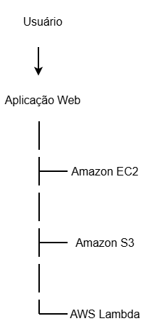

# Projeto – Implementação de Serviços AWS para Redução de Custos

## Descrição

Este projeto apresenta um relatório técnico de implementação de serviços da Amazon Web Services (AWS) com foco na redução de custos de infraestrutura em uma empresa fictícia chamada Abstergo Industries.

O objetivo é demonstrar como serviços de computação em nuvem podem substituir infraestruturas tradicionais, reduzindo custos operacionais e aumentando a escalabilidade dos sistemas.

---

## Objetivos do Projeto

- Identificar serviços AWS capazes de reduzir custos de infraestrutura
- Demonstrar um cenário de migração de servidores locais para cloud
- Apresentar um relatório técnico de implementação
- Simular redução de custos utilizando ferramentas da AWS

---

## Serviços AWS Utilizados

- Amazon S3 – Armazenamento de dados escalável
- Amazon EC2 – Servidores virtuais sob demanda
- AWS Lambda – Execução de código sem servidor (serverless)

---

## Estrutura do Projeto

* **aws-project**
    * README.md
    * **relatorio**
        * relatorio\_implementacao\_aws.md
    * **anexos**
        * estimativa\_custos.xlsx
        * arquitetura\_aws.png
    * **imagens**
        * arquitetura\_preview.png

---

## Arquitetura da Solução

---

## Relatório Técnico

O relatório completo pode ser acessado em:

relatorio/relatorio_implementacao_aws.md

---

## Estimativa de Custos

Foi realizada uma simulação de redução de custos utilizando a ferramenta:

AWS Pricing Calculator

https://calculator.aws/

---

## Tecnologias e Conceitos Utilizados

- Cloud Computing
- Amazon Web Services
- Arquitetura em Nuvem
- Redução de custos em infraestrutura
- Computação Serverless

---

## Autor

Liliane Refatti

Cientista de Dados | Python | SQL | Power BI | Estatística
